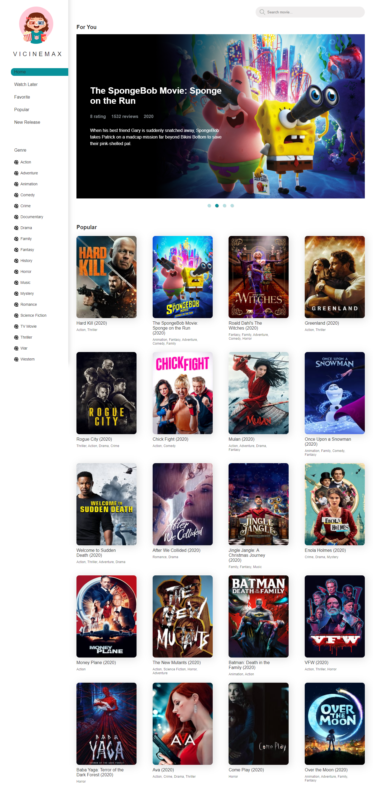

# Vicinemax | Movie Library for Fun



Keep update with popular and latest movies.

### Live

[Live here](https://movie.hafisalrafi.com/)

[](https://app.netlify.com/sites/vicinemax/deploys)

### Configure

Get the repo

```sh
git clone https://github.com/alrafi/vicinemax.git
cd vicinemax
npm install
npm start
```

Add `.env` file to your root directory and add the following

```js
REACT_APP_TMDB_API_KEY=[YOUR_TMDB_APIKEY]
```

Powered by [TMDB](https://www.themoviedb.org/).


### Authors

Hafis Alrafi
